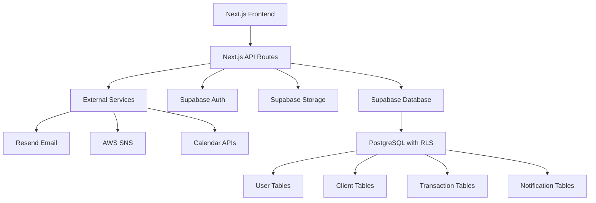

# Design Document

## Overview

This document outlines the technical design for a modern, professional real estate CRM web application built with Next.js 15+, TypeScript, Tailwind CSS, and Supabase. The system will provide comprehensive client management, deal tracking, financial analytics, and business automation for real estate professionals.

The design leverages the existing Luma templates as the foundation for UI components and layout structure, ensuring a consistent, professional appearance with clean white backgrounds and modern card-based interfaces.

## Architecture

### Technology Stack

**Frontend:**
- **Framework**: Next.js 15+ with App Router
- **Language**: TypeScript for type safety and developer experience
- **Styling**: Tailwind CSS with custom components based on Luma templates
- **UI Components**: Custom components derived from Luma template patterns
- **Icons**: Lucide React for consistent iconography
- **State Management**: React hooks, Context API, and SWR for data fetching

**Backend & Database:**
- **Database**: Supabase (PostgreSQL) with Row Level Security (RLS)
- **Authentication**: Supabase Auth with email/password and OAuth providers
- **API**: Next.js API routes with RESTful design patterns
- **File Storage**: Supabase Storage for document management
- **Real-time**: Supabase Realtime for live updates

**External Services:**
- **Email**: Resend for transactional emails and notifications
- **SMS**: AWS SNS for SMS alerts and reminders
- **Calendar**: Integration with Google Calendar and Outlook

### System Architecture



## Components and Interfaces

### Core Layout Components

Based on the Luma templates, the application will use a consistent layout structure:

**1. Sidebar Navigation (`components/layout/Sidebar.tsx`)**
- Fixed left sidebar with collapsible functionality
- Logo display with full/collapsed states
- Navigation menu with active state indicators
- Trial notice component (customizable for different plans)
- Smooth transitions and responsive behavior

**2. Top Navigation (`components/layout/TopNav.tsx`)**
- Header with page title and breadcrumbs
- User profile dropdown with avatar
- Notification bell with badge counter
- Quick action buttons (context-sensitive)
- Mobile menu toggle for responsive design

**3. Main Content Area (`components/layout/MainContent.tsx`)**
- Clean white background with proper spacing
- Card-based content organization
- Responsive grid layouts
- Consistent padding and margins

### Feature-Specific Components

**Authentication Components:**
- `LoginForm`: Email/password authentication with validation
- `RegisterForm`: User registration with role selection
- `ForgotPasswordForm`: Password recovery workflow
- `OAuthButtons`: Google and other OAuth provider integration

**Dashboard Components:**
- `MetricsCards`: Key performance indicators with trend indicators
- `PerformanceChart`: Interactive charts using Chart.js
- `ActivityFeed`: Recent actions and updates timeline
- `QuickActions`: Contextual action buttons for common tasks
- `UpcomingTasks`: Task list with checkbox functionality

**Client Management Components:**
- `ClientCard`: Individual client information display
- `ClientList`: Paginated client listing with filters
- `ClientForm`: Add/edit client information
- `ClientStageTracker`: Visual pipeline stage progression
- `DocumentUpload`: File management for client documents

**Financial Components:**
- `TransactionTable`: Based on the CSV structure provided
- `CommissionCalculator`: Automatic commission calculations
- `RevenueChart`: Financial performance visualization
- `GoalTracker`: Progress towards financial targets
- `CSVImportExport`: Data import/export functionality**Calen
dar Components:**
- `CalendarView`: Monthly/weekly calendar display
- `AppointmentForm`: Schedule and manage appointments
- `DeadlineTracker`: Automated deadline monitoring
- `CalendarIntegration`: External calendar sync functionality

**Notification Components:**
- `NotificationCenter`: In-app notification management
- `NotificationPreferences`: User notification settings
- `EmailTemplates`: Customizable email notification templates
- `SMSAlerts`: SMS notification configuration

### Interface Definitions

**User Interface:**
```typescript
interface User {
  id: string;
  email: string;
  name: string;
  role: 'SuperAdmin' | 'Admin' | 'Assistant';
  avatar_url?: string;
  created_at: string;
  updated_at: string;
}
```

**Client Interface:**
```typescript
interface Client {
  id: string;
  name: string;
  email: string;
  phone?: string;
  type: 'Lead' | 'Prospect' | 'Client' | 'Closed';
  source: string;
  budget_min?: number;
  budget_max?: number;
  preferred_area?: string;
  notes?: string;
  documents: Document[];
  created_at: string;
  updated_at: string;
  last_contact?: string;
  assigned_agent: string;
}
```

**Transaction Interface:**
```typescript
interface Transaction {
  id: string;
  address: string;
  client_id: string;
  price: number;
  commission_rate: number;
  gross_commission: number;
  net_commission: number;
  broker_commission: number;
  status: 'Active' | 'Pending' | 'Closed';
  closing_date?: string;
  created_at: string;
  updated_at: string;
}
```

## Data Models

### Database Schema

**Users Table (auth.users extended with profiles):**
```sql
CREATE TABLE public.profiles (
  id UUID REFERENCES auth.users ON DELETE CASCADE,
  email TEXT NOT NULL,
  name TEXT NOT NULL,
  role TEXT CHECK (role IN ('SuperAdmin', 'Admin', 'Assistant')) DEFAULT 'Assistant',
  avatar_url TEXT,
  created_at TIMESTAMP WITH TIME ZONE DEFAULT NOW(),
  updated_at TIMESTAMP WITH TIME ZONE DEFAULT NOW(),
  PRIMARY KEY (id)
);
```

**Clients Table:**
```sql
CREATE TABLE public.clients (
  id UUID DEFAULT gen_random_uuid() PRIMARY KEY,
  name TEXT NOT NULL,
  email TEXT NOT NULL,
  phone TEXT,
  type TEXT CHECK (type IN ('Lead', 'Prospect', 'Client', 'Closed')) DEFAULT 'Lead',
  source TEXT,
  budget_min DECIMAL,
  budget_max DECIMAL,
  preferred_area TEXT,
  notes TEXT,
  assigned_agent UUID REFERENCES public.profiles(id),
  last_contact TIMESTAMP WITH TIME ZONE,
  created_at TIMESTAMP WITH TIME ZONE DEFAULT NOW(),
  updated_at TIMESTAMP WITH TIME ZONE DEFAULT NOW()
);
```

**Transactions Table:**
```sql
CREATE TABLE public.transactions (
  id UUID DEFAULT gen_random_uuid() PRIMARY KEY,
  address TEXT NOT NULL,
  client_id UUID REFERENCES public.clients(id),
  price DECIMAL NOT NULL,
  commission_rate DECIMAL NOT NULL,
  gross_commission DECIMAL GENERATED ALWAYS AS (price * commission_rate / 100) STORED,
  net_commission DECIMAL,
  broker_commission DECIMAL,
  status TEXT CHECK (status IN ('Active', 'Pending', 'Closed')) DEFAULT 'Active',
  closing_date DATE,
  created_at TIMESTAMP WITH TIME ZONE DEFAULT NOW(),
  updated_at TIMESTAMP WITH TIME ZONE DEFAULT NOW()
);
```

**Documents Table:**
```sql
CREATE TABLE public.documents (
  id UUID DEFAULT gen_random_uuid() PRIMARY KEY,
  client_id UUID REFERENCES public.clients(id),
  filename TEXT NOT NULL,
  file_path TEXT NOT NULL,
  file_size INTEGER,
  mime_type TEXT,
  uploaded_by UUID REFERENCES public.profiles(id),
  created_at TIMESTAMP WITH TIME ZONE DEFAULT NOW()
);
```

**Appointments Table:**
```sql
CREATE TABLE public.appointments (
  id UUID DEFAULT gen_random_uuid() PRIMARY KEY,
  title TEXT NOT NULL,
  description TEXT,
  client_id UUID REFERENCES public.clients(id),
  start_time TIMESTAMP WITH TIME ZONE NOT NULL,
  end_time TIMESTAMP WITH TIME ZONE NOT NULL,
  location TEXT,
  type TEXT CHECK (type IN ('Showing', 'Meeting', 'Call', 'Deadline')),
  status TEXT CHECK (status IN ('Scheduled', 'Completed', 'Cancelled')) DEFAULT 'Scheduled',
  created_by UUID REFERENCES public.profiles(id),
  created_at TIMESTAMP WITH TIME ZONE DEFAULT NOW(),
  updated_at TIMESTAMP WITH TIME ZONE DEFAULT NOW()
);
```

**Notifications Table:**
```sql
CREATE TABLE public.notifications (
  id UUID DEFAULT gen_random_uuid() PRIMARY KEY,
  user_id UUID REFERENCES public.profiles(id),
  title TEXT NOT NULL,
  message TEXT NOT NULL,
  type TEXT CHECK (type IN ('info', 'success', 'warning', 'error')) DEFAULT 'info',
  read BOOLEAN DEFAULT FALSE,
  action_url TEXT,
  created_at TIMESTAMP WITH TIME ZONE DEFAULT NOW()
);
```

### Row Level Security (RLS) Policies

All tables will implement RLS to ensure data security:

```sql
-- Enable RLS on all tables
ALTER TABLE public.profiles ENABLE ROW LEVEL SECURITY;
ALTER TABLE public.clients ENABLE ROW LEVEL SECURITY;
ALTER TABLE public.transactions ENABLE ROW LEVEL SECURITY;
ALTER TABLE public.documents ENABLE ROW LEVEL SECURITY;
ALTER TABLE public.appointments ENABLE ROW LEVEL SECURITY;
ALTER TABLE public.notifications ENABLE ROW LEVEL SECURITY;

-- Example policy for clients table
CREATE POLICY "Users can view clients assigned to them" ON public.clients
  FOR SELECT USING (assigned_agent = auth.uid());

CREATE POLICY "Users can insert clients" ON public.clients
  FOR INSERT WITH CHECK (assigned_agent = auth.uid());

CREATE POLICY "Users can update their assigned clients" ON public.clients
  FOR UPDATE USING (assigned_agent = auth.uid());
```

## Error Handling

### Frontend Error Handling

**1. API Error Handling:**
- Centralized error handling using custom hooks
- User-friendly error messages with fallback options
- Automatic retry mechanisms for transient failures
- Loading states and error boundaries

**2. Form Validation:**
- Real-time validation using React Hook Form
- Server-side validation with detailed error responses
- Field-level error display with clear messaging

**3. Network Error Handling:**
- Offline detection and graceful degradation
- Request timeout handling
- Connection retry logic

### Backend Error Handling

**1. API Route Error Handling:**
```typescript
// utils/errorHandler.ts
export class APIError extends Error {
  statusCode: number;
  constructor(message: string, statusCode: number = 500) {
    super(message);
    this.statusCode = statusCode;
  }
}

export function handleAPIError(error: unknown) {
  if (error instanceof APIError) {
    return { error: error.message, statusCode: error.statusCode };
  }
  return { error: 'Internal server error', statusCode: 500 };
}
```

**2. Database Error Handling:**
- Supabase error code mapping to user-friendly messages
- Transaction rollback on failures
- Constraint violation handling

**3. Authentication Error Handling:**
- Session expiration detection and refresh
- Role-based access control violations
- OAuth provider error handling

## Testing Strategy

### Unit Testing
- **Framework**: Jest with React Testing Library
- **Coverage**: All utility functions, hooks, and components
- **Mocking**: Supabase client and external API calls
- **Test Files**: Co-located with components (`*.test.tsx`)

### Integration Testing
- **Database Testing**: Supabase local development environment
- **API Testing**: Next.js API routes with test database
- **Authentication Testing**: Mock auth states and user roles

### End-to-End Testing
- **Framework**: Playwright for cross-browser testing
- **Scenarios**: Critical user journeys (login, client management, transactions)
- **Data Setup**: Test data seeding and cleanup

### Performance Testing
- **Metrics**: Core Web Vitals monitoring
- **Tools**: Lighthouse CI for automated performance audits
- **Database**: Query performance optimization and indexing

### Testing Structure
```
tests/
├── __mocks__/           # Mock implementations
├── unit/               # Unit tests
├── integration/        # Integration tests
├── e2e/               # End-to-end tests
└── utils/             # Test utilities and helpers
```

This comprehensive design provides a solid foundation for building a professional, scalable real estate CRM that leverages modern web technologies while maintaining the clean, professional aesthetic established by the Luma templates.