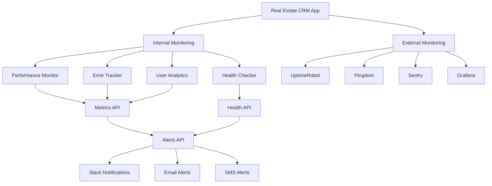

# Production Monitoring Guide

## Overview

This guide covers the comprehensive monitoring setup for the Real Estate CRM application, including application performance monitoring, error tracking, user analytics, and alerting systems.

## Monitoring Architecture



## Internal Monitoring Components

### 1. Performance Monitoring

**Location**: `src/lib/monitoring.ts`

Tracks:
- API response times (average, p50, p95, p99)
- Database query performance
- Memory usage and system metrics
- Core Web Vitals (LCP, FID, CLS)

**Key Metrics**:
```typescript
{
  performance: {
    api_/api/clients: {
      count: 150,
      avg: 245,
      min: 89,
      max: 1200,
      p50: 220,
      p95: 450,
      p99: 800
    },
    db_query: {
      count: 500,
      avg: 125,
      p95: 300
    }
  }
}
```

### 2. Error Tracking

**Location**: `src/lib/monitoring.ts`

Tracks:
- Application errors with stack traces
- API errors by endpoint and status code
- Error severity levels (low, medium, high, critical)
- Error frequency and patterns

**Usage**:
```typescript
import { errorTracker } from '@/lib/monitoring';

errorTracker.trackError(
  new Error('Database connection failed'),
  { userId: '123', action: 'fetch_clients' },
  'high'
);
```

### 3. User Analytics

**Location**: `src/lib/monitoring.ts`

Tracks:
- User sessions and activity
- Page views and navigation patterns
- User actions and interactions
- Session duration and engagement

### 4. Health Checks

**Location**: `src/app/api/monitoring/health/route.ts`

Monitors:
- Database connectivity
- File storage availability
- External service health
- Memory usage thresholds

## Monitoring Endpoints

### Health Check Endpoints

| Endpoint | Purpose | Response |
|----------|---------|----------|
| `/health` | Basic application health | Service status, uptime, memory |
| `/api/health` | Detailed health check | Same as `/health` |
| `/api/health/database` | Database-specific health | Connection status, query performance |
| `/api/monitoring/health` | Comprehensive health | All registered health checks |

### Metrics Endpoints

| Endpoint | Purpose | Auth Required |
|----------|---------|---------------|
| `/api/monitoring/metrics` | Performance and error metrics | Yes |
| `/api/monitoring/alerts` | Active alerts and alert history | Yes |

## Alert System

### Alert Rules

**High Error Rate**
- Condition: >10 errors in the last hour
- Severity: High
- Action: Slack notification

**Slow API Response**
- Condition: 95th percentile >5 seconds
- Severity: Medium
- Action: Slack notification

**High Memory Usage**
- Condition: >85% memory utilization
- Severity: Medium
- Action: Slack notification

**Critical Errors**
- Condition: Any critical severity error
- Severity: Critical
- Action: Slack + Email notification

**Slow Database Queries**
- Condition: 95th percentile >2 seconds
- Severity: Medium
- Action: Slack notification

### Alert Configuration

```typescript
// Environment variables for alerting
SLACK_WEBHOOK_URL=https://hooks.slack.com/services/...
ADMIN_EMAIL=admin@yourcompany.com
MONITORING_API_KEY=your-secure-api-key
```

## External Monitoring Services

### 1. UptimeRobot Setup

**Monitors**:
- Production main site
- Production API health endpoint
- Production database health endpoint
- Staging environment

**Configuration**:
```bash
# Set environment variables
export UPTIMEROBOT_API_KEY=your-api-key
export UPTIMEROBOT_ALERT_CONTACTS=contact-id

# Run setup script
./scripts/monitoring-setup.sh
```

### 2. Pingdom Setup

**Checks**:
- HTTP/HTTPS availability
- Response time monitoring
- SSL certificate monitoring
- DNS resolution checks

### 3. Sentry Error Tracking

**Features**:
- Real-time error tracking
- Performance monitoring
- Release tracking
- User context and breadcrumbs

**Setup**:
```bash
# Install Sentry
npm install @sentry/nextjs

# Configure environment
SENTRY_DSN=https://your-dsn@sentry.io/project-id
SENTRY_ORG=your-org
SENTRY_PROJECT=your-project
```

### 4. Grafana Dashboards

**Dashboards**:
- API Performance Dashboard
- Error Rate Dashboard
- User Analytics Dashboard
- System Health Dashboard

## Monitoring Hooks

### React Hooks for Client-Side Monitoring

```typescript
import { 
  usePageTracking, 
  useActionTracking, 
  useErrorTracking,
  useWebVitals 
} from '@/hooks/useMonitoring';

function MyComponent() {
  // Track page views automatically
  usePageTracking();
  
  // Track Core Web Vitals
  useWebVitals();
  
  // Track user actions
  const trackAction = useActionTracking();
  
  // Track errors
  const trackError = useErrorTracking();
  
  const handleClick = () => {
    trackAction('button_click', { buttonId: 'submit' });
  };
  
  const handleError = (error: Error) => {
    trackError(error, { component: 'MyComponent' }, 'medium');
  };
}
```

## Deployment Monitoring

### CI/CD Pipeline Monitoring

The CI/CD pipeline includes monitoring checks:

1. **Build Monitoring**: Track build times and success rates
2. **Test Monitoring**: Monitor test execution and coverage
3. **Deployment Monitoring**: Track deployment success and rollback events
4. **Post-Deployment Monitoring**: Automated smoke tests and health checks

### Automated Monitoring Setup

```bash
# Run the monitoring setup script
./scripts/monitoring-setup.sh

# This script will:
# 1. Set up UptimeRobot monitors
# 2. Configure Pingdom checks
# 3. Initialize Sentry error tracking
# 4. Create Grafana dashboards
# 5. Test all monitoring endpoints
# 6. Send test alerts
```

## Monitoring Best Practices

### 1. Alert Fatigue Prevention

- Use appropriate severity levels
- Implement alert throttling
- Group related alerts
- Provide clear resolution steps

### 2. Performance Monitoring

- Monitor key user journeys
- Track business-critical metrics
- Set realistic performance budgets
- Monitor both client and server performance

### 3. Error Monitoring

- Categorize errors by severity
- Include relevant context
- Track error trends over time
- Implement error recovery mechanisms

### 4. Capacity Planning

- Monitor resource utilization trends
- Set up predictive alerts
- Plan for traffic spikes
- Monitor database growth

## Troubleshooting

### Common Issues

**High Memory Usage**
1. Check for memory leaks in application code
2. Review database connection pooling
3. Monitor garbage collection patterns
4. Consider scaling resources

**Slow API Responses**
1. Analyze database query performance
2. Check for N+1 query problems
3. Review caching strategies
4. Monitor external service dependencies

**High Error Rates**
1. Check recent deployments
2. Review error logs for patterns
3. Monitor external service status
4. Verify database connectivity

### Monitoring Dashboard Access

**Production Metrics**: `https://your-domain.com/api/monitoring/metrics`
**Health Status**: `https://your-domain.com/api/monitoring/health`
**Active Alerts**: `https://your-domain.com/api/monitoring/alerts`

### Emergency Procedures

1. **Critical Alert Response**
   - Acknowledge alert within 5 minutes
   - Assess impact and severity
   - Implement immediate mitigation
   - Communicate status to stakeholders

2. **Service Degradation**
   - Enable maintenance mode if necessary
   - Scale resources if possible
   - Implement circuit breakers
   - Prepare rollback plan

3. **Complete Outage**
   - Activate incident response team
   - Implement disaster recovery procedures
   - Communicate with users
   - Document incident for post-mortem

## Monitoring Costs

### Estimated Monthly Costs

- **UptimeRobot**: $7/month (Pro plan)
- **Pingdom**: $15/month (Starter plan)
- **Sentry**: $26/month (Team plan)
- **Grafana Cloud**: $49/month (Pro plan)

**Total**: ~$97/month for comprehensive monitoring

### Cost Optimization

- Use free tiers where possible
- Implement sampling for high-volume metrics
- Archive old monitoring data
- Review and optimize alert rules regularly

This monitoring setup provides comprehensive visibility into the Real Estate CRM application's health, performance, and user experience, enabling proactive issue detection and resolution.